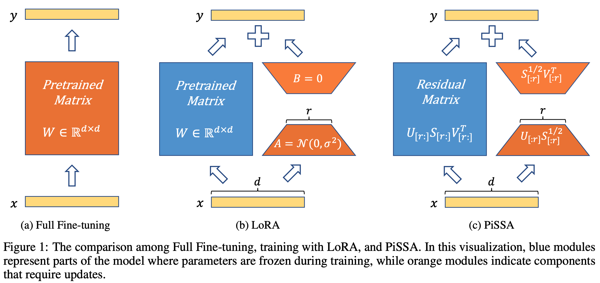
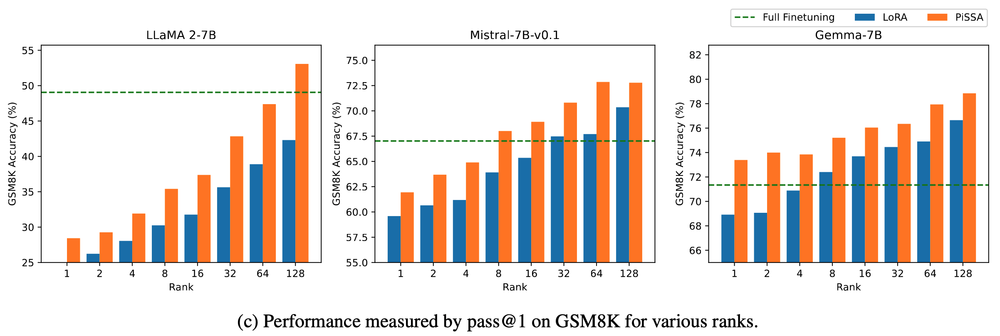
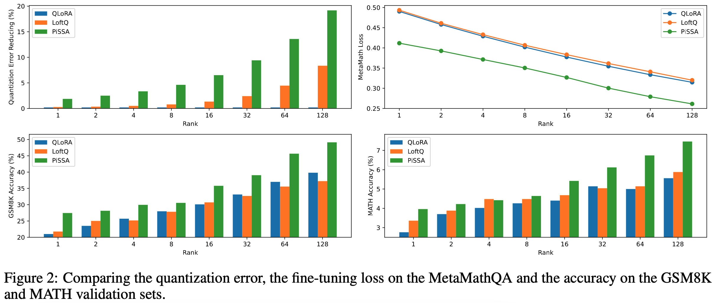

# **P**r**i**ncipal **S**ingular values and **S**ingular vectors **A**daptation

## Introduction
We introduce a parameter-efficient fine-tuning (PEFT) method, **P**r**i**ncipal **S**ingular values and **S**ingular vectors **A**daptation (PiSSA), which optimizes the essential singular values and vectors while freezing the "noisy" parts. In comparison, LoRA freezes the original matrix and updates the "noise". This distinction enables PiSSA to convergence much faster than LoRA and also achieve better performance in the end. On five common benchmarks, PiSSA outperforms LoRA on all of them using exactly the same setups except for a different initialization. On GSM8K, Mistral-7B fine-tuned with PiSSA achieves an accuracy of 72.86\%, outperforming LoRA's 67.7\% by 5.16\%.
Due to the same architecture, PiSSA inherits many of LoRA's advantages, such as parameter efficiency and compatibility with quantization. 
Furthermore, PiSSA reduces the 4-bit quantization error in LLaMA 2-7B by 18.97\%, resulting in a substantial improvement in fine-tuning performance. On the GSM8K benchmark, PiSSA achieves an accuracy of 49.13\%, surpassing the performances of QLoRA at 39.8\% and LoftQ at 40.71\%.
Leveraging a fast SVD technique, the initialization of PiSSA takes only a few seconds, inducing negligible cost of switching LoRA to PiSSA.





## Quick Start

Install PiSSA via pip:
```
pip install git+https://github.com/fxmeng/peft.git
```
Initialize a PiSSA and finetune it:
```python
import torch
from peft import LoraConfig, get_peft_model
from transformers import AutoTokenizer, AutoModelForCausalLM
from trl import SFTTrainer
from datasets import load_dataset

model = AutoModelForCausalLM.from_pretrained("meta-llama/Llama-2-7b-hf", torch_dtype=torch.bfloat16, device_map="auto")
tokenizer = AutoTokenizer.from_pretrained("meta-llama/Llama-2-7b-hf")
tokenizer.pad_token_id = tokenizer.eos_token_id
lora_config = LoraConfig(
    # init_lora_weights="pissa", # Configure the initialization method to "pissa", which may take several minutes to execute SVD on the pre-trained model.
    init_lora_weights="pissa_niter_4", # Initialize the PiSSA with fast SVD, which completes in just a few seconds.
)
peft_model = get_peft_model(model, lora_config)

peft_model.print_trainable_parameters()

dataset = load_dataset("imdb", split="train[:1%]")

trainer = SFTTrainer(
    model=peft_model,
    train_dataset=dataset,
    dataset_text_field="text",
    max_seq_length=128,
    tokenizer=tokenizer,
)
trainer.train()
peft_model.save_pretrained("pissa-llama-2-7b")
```
When utilizing fast SVD, reducing the rank and the number of iterations decreases the time required. However, this approach leads to higher errors in the computed matrices $A$ and $B$. To preserve the model's initial capabilities, we calculate the residual matrix by $W^{res} = W - BA$. Even with potential errors in $A$ and $B$, the sum of $W^{res}$ and $BA$ accurately equals $W$.


To utilize the fine-tuned PiSSA modules, simply run the following command:
```python
import torch
from peft import PeftModel
from transformers import AutoModelForCausalLM

model = AutoModelForCausalLM.from_pretrained(
    "meta-llama/Llama-2-7b-hf", torch_dtype=torch.bfloat16, device_map="auto"
)
# Performs SVD again to initialize the residual model and loads the state_dict of the fine-tuned PiSSA modules.
peft_model = PeftModel.from_pretrained(model, "pissa-llama-2-7b")
```

## Advanced Usage

### Access the preprocessed models
We recommend downloading decomposed models directly from the [Hugging Face Collections](https://huggingface.co/collections/fxmeng/pissa-661ce700721235e542a5d7a8) instead of performing SVD every time.
If the existing models do not meet your needs, apply PiSSA initialization to a pre-trained model and store the decomposed model locally:
```bash
python preprocess.py \
    --base_model_name_or_path meta-llama/Llama-2-7b-hf \
    --init_lora_weights pissa \
    --output_dir pissa-llama-2-7b-r32 \
    --lora_r 32 \
    --lora_alpha 32 \
    --lora_dropout 0 \
    --bits bf16
```

### Convert PiSSA to LoRA
When using `peft_model.save_pretrained`, if `save_as_lora=None`, the fine-tuned matrices $A$ and $B$ are saved and should be combined with the residual model. However, when specifying `save_as_lora="pissa_init_dir"`, the saving function converts PiSSA to LoRA by $\Delta W = A \times B - A_0 \times B_0 =  [A | A_0] \times [B | -B_0]^T=A^{'}B^{'}$. This conversion enables the loading of LoRA on top of a standard base model:

```python
import torch
from peft import PeftModel
from transformers import AutoModelForCausalLM

model = AutoModelForCausalLM.from_pretrained(
    "meta-llama/Llama-2-7b-hf", torch_dtype=torch.bfloat16, device_map="auto"
)
# No SVD is performed during this step, and the base model remains unaltered.
peft_model = PeftModel.from_pretrained(model, "pissa-llama-2-7b-lora")
```
Utilizing the converted LoRA does not require modifying the parameters of the base model. When multiple converted LoRAs are needed simultaneously, each adapter operates independently without interference, allowing for the adapters to be freely deleted or added.


## Reproduce the Results
### Preparing The Models and Datasets
All the models and datasets we used are publicly available at [Hugging Face Collections](https://huggingface.co/collections/fxmeng/pissa-661ce700721235e542a5d7a8).
### Training and Evaluation
```
cd PiSSA
sh scripts/xxx.sh
```
## Citation
```
@article{meng2024pissa,
  title={PiSSA: Principal Singular Values and Singular Vectors Adaptation of Large Language Models},
  author={Meng, Fanxu and Wang, Zhaohui and Zhang, Muhan},
  journal={arXiv preprint arXiv:2404.02948},
  year={2024}
}
```

## Star History

[](https://star-history.com/#GraphPKU/PiSSA&Date)
