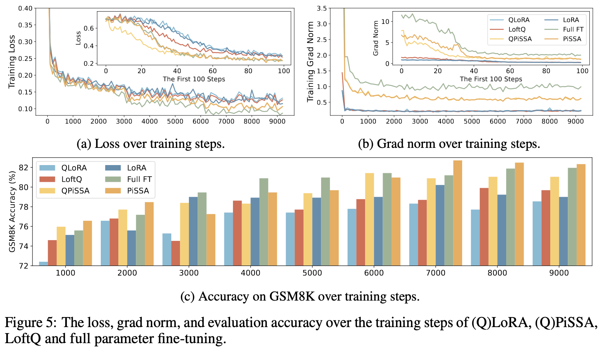

# **P**r**i**ncipal **S**ingular values and **S**ingular vectors **A**daptation

[YouTube](https://youtu.be/X37WFwJ3nT4)

## Introduction
We introduce a parameter-efficient fine-tuning (PEFT) method, **P**r**i**ncipal **S**ingular values and **S**ingular vectors **A**daptation (PiSSA), which optimizes the essential singular values and vectors while freezing the "noisy" parts. In comparison, LoRA freezes the original matrix and updates the "noise". This distinction enables PiSSA to convergence much faster than LoRA and also achieve better performance in the end. On five common benchmarks, PiSSA outperforms LoRA on all of them using exactly the same setups except for a different initialization. On GSM8K, Mistral-7B fine-tuned with PiSSA achieves an accuracy of 72.86\%, outperforming LoRA's 67.7\% by 5.16\%.
Due to the same architecture, PiSSA inherits many of LoRA's advantages, such as parameter efficiency and compatibility with quantization. 
Furthermore, PiSSA reduces the 4-bit quantization error in LLaMA 2-7B by 18.97\%, resulting in a substantial improvement in fine-tuning performance. On the GSM8K benchmark, PiSSA achieves an accuracy of 49.13\%, surpassing the performances of QLoRA at 39.8\% and LoftQ at 40.71\%.
Leveraging a fast SVD technique, the initialization of PiSSA takes only a few seconds, inducing negligible cost of switching LoRA to PiSSA.





## News
- [2025.01.09] Provide [Document](https://huggingface.co/datasets/fxmeng/pissa-dataset) and [中文文档](https://hf-mirror.com/datasets/fxmeng/pissa-dataset/blob/main/README_CN.md) to help you better use PiSSA for training and testing.
- [2024.07.17] PiSSA now support Conv2d and Embedding, [here](pissa-sdxl.ipynb) is an example for using PiSSA on SDXL.
- [2024.07.16] PiSSA now support deepspeed.
- [2024.05.16] PiSSA has been merged into the [main branch of peft](https://github.com/huggingface/peft) as an optional initialization method for LoRA.

## Quick Start

Install PiSSA via pip:
```
git clone https://github.com/GraphPKU/PiSSA.git
cd PiSSA/
# export HF_ENDPOINT=https://hf-mirror.com
pip install -U huggingface_hub
huggingface-cli download --repo-type dataset --resume-download fxmeng/pissa-dataset --local-dir pissa-dataset
conda create -n pissa python=3.10
conda activate pissa
conda install nvidia/label/cuda-12.1.0::cuda-toolkit
conda install pytorch==2.4.0 torchvision=0.19.0 pytorch-cuda=12.1 -c pytorch -c nvidia
pip install -r requirements.txt
pip install flash-attn --no-build-isolation
```

## Reproduce the Results
All the datasets we used are publicly available at [Dataset](https://huggingface.co/datasets/fxmeng/pissa-dataset).

The PiSSA-initialized models are shared on [Models](https://huggingface.co/collections/fxmeng/pissa-qwen2-666a55e58b6feadc1015aa75) for easy reuse. They retain the same input and output as the original models but are split into residual models and PiSSA adapters for more effective fine-tuning.

|  | PiSSA | QPiSSA |
| --- | --- | --- |
| LLaMA-2-7B | [r128](https://huggingface.co/collections/fxmeng/pissa-llama-2-7b-66377477f7acbb051bc5dc6c) | [r16,32,64,128](https://huggingface.co/collections/fxmeng/pissa-llama-2-7b-66377477f7acbb051bc5dc6c) |
| LLaMA-3-8B | [r16,32,64,128](https://huggingface.co/collections/fxmeng/pissa-llama-3-8b-6637591fe4156d34a4191628) | [r64,128](https://huggingface.co/collections/fxmeng/pissa-llama-3-8b-6637591fe4156d34a4191628) |
| LLaMA-3-8B-Instruct | [r16,32,64,128](https://huggingface.co/collections/fxmeng/pissa-llama-3-8b-instruct-663774dbd2174225c139a653) | -- |
| LLaMA-3-70B | -- | [r64,128](https://huggingface.co/collections/fxmeng/pissa-llama-3-70b-66376205164dfca129a4caf1) |
| LLaMA-3-70B-Instruct | -- | [r128](https://huggingface.co/collections/fxmeng/pissa-llama-3-70b-66376205164dfca129a4caf1) |
| Qwen2-7B | [r128](https://huggingface.co/collections/fxmeng/pissa-qwen2-666a55e58b6feadc1015aa75) | [r128](https://huggingface.co/collections/fxmeng/pissa-qwen2-666a55e58b6feadc1015aa75) |
| Qwen2-7B-Instruct | [r128](https://huggingface.co/collections/fxmeng/pissa-qwen2-666a55e58b6feadc1015aa75) | [r128](https://huggingface.co/collections/fxmeng/pissa-qwen2-666a55e58b6feadc1015aa75) |
| Qwen2-72B | --| [r64,128](https://huggingface.co/collections/fxmeng/pissa-qwen2-666a55e58b6feadc1015aa75) |
| Qwen2-72B-Instruct | --| [r64,128](https://huggingface.co/collections/fxmeng/pissa-qwen2-666a55e58b6feadc1015aa75) |

### Training
Running the following script will automatically download the model, then start training:
```
sh scripts/*/run_full_finetune.sh
sh scripts/*/lora.sh
sh scripts/*/pissa.sh
sh scripts/*/loftq.sh
sh scripts/*/qlora.sh
sh scripts/*/qpissa.sh
```
### Evaluation
To evaluate the performance of your fine-tuned model, please follow the instructions in [fxmeng/pissa-dataset](https://huggingface.co/datasets/fxmeng/pissa-dataset).

## Advanced Usage
We recommend downloading decomposed models directly from the [Hugging Face Collections](https://huggingface.co/collections/fxmeng) instead of performing SVD every time.
If the existing models do not meet your needs, apply PiSSA initialization to a pre-trained model and store the decomposed model locally:
```python
import torch
import os
from peft import LoraConfig, get_peft_model
from transformers import AutoTokenizer, AutoModelForCausalLM
MODEL_ID = "meta-llama/Llama-2-7b-hf"
model = AutoModelForCausalLM.from_pretrained(MODEL_ID, torch_dtype=torch.bfloat16, device_map="auto")
tokenizer = AutoTokenizer.from_pretrained(MODEL_ID)
tokenizer.pad_token_id = tokenizer.eos_token_id
lora_config = LoraConfig(
    # init_lora_weights="pissa", # Configure the initialization method to "pissa", which may take several minutes to execute SVD on the pre-trained model.
    init_lora_weights="pissa_niter_4", # Initialize the PiSSA with fast SVD, which completes in just a few seconds.
    r=128,
    lora_alpha=128,
    lora_dropout=0, # Since the component of the PiSSA adapter are the principal singular values and vectors, dropout should be set to 0 to avoid random discarding.
    target_modules=["q_proj", "o_proj", "k_proj", "v_proj", "gate_proj", "up_proj", "down_proj"],
    task_type="CAUSAL_LM",
)
peft_model = get_peft_model(model, lora_config)
peft_model.print_trainable_parameters()
OUTPUT_DIR="PiSSA-Llama-2-7b-hf-r128"
# Save PiSSA modules:
peft_model.peft_config["default"].init_lora_weights = True # Important
peft_model.save_pretrained(os.path.join(OUTPUT_DIR, "pissa_init"))
# Save residual model:
peft_model = peft_model.unload()
peft_model.save_pretrained(OUTPUT_DIR)
# Save the tokenizer:
tokenizer.save_pretrained(OUTPUT_DIR)
```

Load a pre-processed model and finetune it on IMDB dataset:

```python
from trl import SFTTrainer
from datasets import load_dataset
from transformers import AutoTokenizer, AutoModelForCausalLM
from peft import PeftModel
MODEL_ID = "PiSSA-Llama-2-7b-hf-r128"
residual_model = AutoModelForCausalLM.from_pretrained(MODEL_ID,device_map="auto")
model = PeftModel.from_pretrained(residual_model, MODEL_ID, subfolder = "pissa_init", is_trainable=True)
tokenizer = AutoTokenizer.from_pretrained(MODEL_ID)
dataset = load_dataset("imdb", split="train[:1%]") # Only use 1% of the dataset
trainer = SFTTrainer(
    model=peft_model,
    train_dataset=dataset,
    dataset_text_field="text",
    max_seq_length=128,
    tokenizer=tokenizer,
)
trainer.train()
peft_model.save_pretrained("pissa-llama-2-7b-ft")
```

### Convert PiSSA to LoRA
When using `peft_model.save_pretrained`, if `path_initial_model_for_weight_conversion=None`, the fine-tuned matrices $A$ and $B$ are saved and should be combined with the residual model. However, when specifying `path_initial_model_for_weight_conversion="pissa_init_dir"`, the saving function converts PiSSA to LoRA by $\Delta W = A B - A_0 B_0 =  [A | A_0] [B | -B_0]^T=A^{'}B^{'}$. This conversion enables the loading of LoRA on top of a standard base model:

```python
import torch
from peft import PeftModel
from transformers import AutoModelForCausalLM

model = AutoModelForCausalLM.from_pretrained(
    "meta-llama/Llama-2-7b-hf", torch_dtype=torch.bfloat16, device_map="auto"
)
# No SVD is performed during this step, and the base model remains unaltered.
peft_model = PeftModel.from_pretrained(model, "pissa-llama-2-7b-lora")
```
Utilizing the converted LoRA does not require modifying the parameters of the base model. When multiple converted LoRAs are needed simultaneously, each adapter operates independently without interference, allowing for the adapters to be freely deleted or added.


## Citation
```
@article{meng2024pissa,
  title={Pissa: Principal singular values and singular vectors adaptation of large language models},
  author={Meng, Fanxu and Wang, Zhaohui and Zhang, Muhan},
  journal={arXiv preprint arXiv:2404.02948},
  year={2024}
}
```

## Star History

[](https://star-history.com/#GraphPKU/PiSSA&Date)

## Follow-up Work
**2024, May 27**, [LoRA-XS: Low-Rank Adaptation with Extremely Small Number of Parameters](https://arxiv.org/abs/2405.17604) performs basis adaption for principal singular values and singular vectors.  
**2024, May 30**, [SVFT: Parameter-Efficient Fine-Tuning with Singular Vectors](https://arxiv.org/abs/2405.19597) freeze the singular vectors while fintune the singular values in a sparse manner.  
**2024, Jun 3**, [OLoRA: Orthonormal Low-Rank Adaptation of Large Language Models](https://arxiv.org/abs/2406.01775), leverages orthonormal matrix initialization through QR decomposition.  
**2024, Jun 7**, [CorDA: Context-Oriented Decomposition Adaptation of Large Language Models](https://arxiv.org/abs/2406.05223), leverages knowledge-preserved adaptation and the instruction-previewed adaptation through Context-oriented Decomposition.  
**2024, Jun 7**, [MiLoRA: Harnessing Minor Singular Components for Parameter-Efficient LLM Finetuning](https://arxiv.org/abs/2406.09044), Minor Singular Components Adaption.  
**2024, Jun 18**, [LaMDA: Large Model Fine-Tuning via Spectrally Decomposed Low-Dimensional Adaptation](https://arxiv.org/abs/2406.12832) performs basis adaption for principal singular values and singular vectors.  
**2024, Jul 6**, [LoRA-GA: Low-Rank Adaptation with Gradient Approximation](https://arxiv.org/abs/2407.05000v1) aligns the gradients of low-rank matrix product with those of full fine-tuning at the first step.  
**2024, Jul 25**, [LoRA-Pro: Are Low-Rank Adapters Properly Optimized?](https://arxiv.org/abs/2407.18242) strategically adjusts the gradients of adapters, enabling the low-rank gradients to more accurately approximate the full fine-tuning gradients.  
**2024, Oct 9**, [One Initialization to Rule them All: Fine-tuning via Explained Variance Adaptation](https://arxiv.org/abs/2410.07170) initialize adapter in a data-driven manner by computing singular value decomposition on minibatches of activation vectors.  
**2024, Nov 7**, [SVDQuant: Absorbing Outliers by Low-Rank Components for 4-Bit Diffusion Models](https://arxiv.org/abs/2411.05007) consolidate the outliers by shifting them from activations to weights, then employ a high-precision low-rank branch to take in the weight outliers with SVD.  
