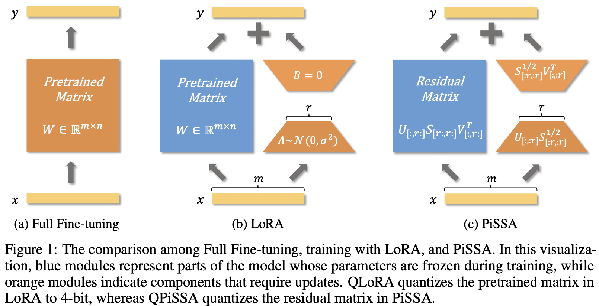

# **P**r**i**ncipal **S**ingular values and **S**ingular vectors **A**daptation

We introduce a parameter-efficient fine-tuning (PEFT) method, **P**r**i**ncipal **S**ingular values and **S**ingular vectors **A**daptation (PiSSA), which optimizes the essential singular values and vectors while freezing the "noisy" parts. In comparison, LoRA freezes the original matrix and updates the "noise". This distinction enables PiSSA to convergence much faster than LoRA and also achieve better performance in the end. On five common benchmarks, PiSSA outperforms LoRA on all of them using exactly the same setups except for a different initialization. On GSM8K, Mistral-7B fine-tuned with PiSSA achieves an accuracy of 72.86\%, outperforming LoRA's 67.7\% by 5.16\%.
Due to the same architecture, PiSSA inherits many of LoRA's advantages, such as parameter efficiency and compatibility with quantization. 
Furthermore, PiSSA reduces the 4-bit quantization error in LLaMA 2-7B by 18.97\%, resulting in a substantial improvement in fine-tuning performance. On the GSM8K benchmark, PiSSA achieves an accuracy of 49.13\%, surpassing the performances of QLoRA at 39.8\% and LoftQ at 40.71\%.
Leveraging a fast SVD technique, the initialization of PiSSA takes only a few seconds, inducing negligible cost of switching LoRA to PiSSA.




## Quickstart :


### Step 1. Install PiSSA via pip:
```
pip install git+https://github.com/fxmeng/peft.git
```
(**Optional**) Installation from Source Code:
```
git clone https://github.com/fxmeng/peft.git
cd peft
pip install -e .

# To modify the implementation, you can edit peft/tuners/lora/layer.py#L155-L188 and adjust the pissa_init method as shown below:
# def pissa_init(self, adapter_name):
#     Ur, Sr, Vr = svd_lowrank(self.base_layer.weight.data, self.r[adapter_name])
#     lora_A = torch.diag(torch.sqrt(Sr)) @ Vh.t()
#     lora_B = Ur @ torch.diag(torch.sqrt(Sr))
#     self.lora_A[adapter_name].weight.data = lora_A
#     self.lora_B[adapter_name].weight.data = lora_B
#     self.base_layer.weight.data = self.base_layer.weight.data - lora_B @ lora_A
```

### Step 2. Preparing the Model and Datasets
Utilize the decomposed models directly from the [Hugging Face Collections](https://huggingface.co/collections/fxmeng/pissa-661ce700721235e542a5d7a8).
If the existing settings do not meet your needs, apply [PiSSA initialization](https://github.com/fxmeng/peft/blob/606a69279480bbdea847f4e5247804bdf7e6b898/examples/pissa_finetuning/pissa_finetuning.py#L85-L103) to a pre-trained model and save the decomposed parameters:

```
# Load an original pre-processed dodel:
model = AutoModelForCausalLM.from_pretrained(...)

# Configure the initialization method to "pissa", which may take several minutes to execute SVD on the pre-trained model:
lora_config = LoraConfig(init_lora_weights="pissa", ...) 

# Alternatively, execute fast SVD, which takes only a few seconds. The number of iterations determines the trade-off between the error and computation time:
# lora_config = LoraConfig(init_lora_weights="pissa_niter_[number of iters]", ...) 

# Perform PiSSA on the original model according to lora_config:
peft_model = get_peft_model(model, lora_config)
```
To eliminate the errors introduced by Fast SVD, we have modified the computation formula for the residual matrix to $W^{res} = W - AB$. Although the calculation of $A$ and $B$ involves errors, the overall initialization error is zero.


(**Recommend**) [Saving the residual model and PiSSA Adapter](https://github.com/fxmeng/peft/blob/51161a52cac3a736d931d90e676b24a32c4f8cd6/src/peft/utils/pissa_utils.py#L27-L51):
```
pissa_pre_training_saving(peft_model, saving_path, ...)
```
Store the decomposed model locally to prevent the necessity of re-decomposition across multiple fine-tuning experiments, and reducing errors in the application of quantization or fast SVD methods:

(**Optional**) If quantization fine-tuning is desired, reload the pre-processed [residual model](https://github.com/fxmeng/peft/blob/606a69279480bbdea847f4e5247804bdf7e6b898/examples/pissa_finetuning/pissa_finetuning.py#L107-L116) in 4-bit or 8-bit configurations along with the full-precision [PiSSA Adapter](https://github.com/fxmeng/peft/blob/606a69279480bbdea847f4e5247804bdf7e6b898/examples/pissa_finetuning/pissa_finetuning.py#L122):
```
res_model = AutoModelForCausalLM.from_pretrained(saving_path, load_in_4/8bit=True, ...)
peft_model = PeftModel.from_pretrained(res_model, f"{saving_path}/pissa_init", is_trainable=True)
```
When SVD is conducted at full precision, the PiSSA adapter retains the high-frequency principal components of the original model. 
Then quantizing the residual model, rather than the original model, notably decreases the quantization error.

### Step 3. Fine-tuning PiSSA
[Training](https://github.com/fxmeng/peft/blob/51161a52cac3a736d931d90e676b24a32c4f8cd6/examples/pissa_finetuning/pissa_finetuning.py#L131-L139) the principal singular values and singular vectors results in faster convergence and enhanced performance:
```
dataset = load_dataset(...)
trainer = SFTTrainer(peft_model, dataset, ...)
# We strongly recommend preserving the pre-trained PiSSA module, which can be utilized at the end of training to compute \Delta AB, thereby converting PiSSA into LoRA for use. 
# This approach eliminates the need to modify the base model, avoids repeated singular value decomposition, and reduces the errors introduced by fast SVD.
peft_model.save_pretrained(os.path.join(args.output_path, "pissa_init"))
trainer.train()
peft_model.save_pretrained(os.path.join(args.output_path, "pissa_ft"))
```

### Step 4. Saving and Sharing
Upon completion of training, it is recommended to [convert PiSSA into LoRA](https://github.com/fxmeng/peft/blob/51161a52cac3a736d931d90e676b24a32c4f8cd6/src/peft/utils/pissa_utils.py#L60-L99) for storage-efficient sharing:

```
pissa_post_training_saving(
    init_path = f"{saving_path}/pissa_init",
    finetuned_path = f"{saving_path}/pissa_ft",
    output_path = f"{saving_path}/pissa_lora",
)
```
Convert PiSSA to LoRA according to $\Delta W = A \times B - A_0 \times B_0 =  [A | A_0] \times [B | -B_0]^T=A^{'}B^{'}$.
Using the converted LoRA does not require modifying the parameters of the base model. When multiple converted LoRAs are needed simultaneously, each adapter operates independently without interference, allowing for the adapters to be freely deleted or added.

## Citation
```
@article{meng2024pissa,
  title={PiSSA: Principal Singular Values and Singular Vectors Adaptation of Large Language Models},
  author={Meng, Fanxu and Wang, Zhaohui and Zhang, Muhan},
  journal={arXiv preprint arXiv:2404.02948},
  year={2024}
}
```

## Star History

[](https://star-history.com/#GraphPKU/PiSSA&Date)
